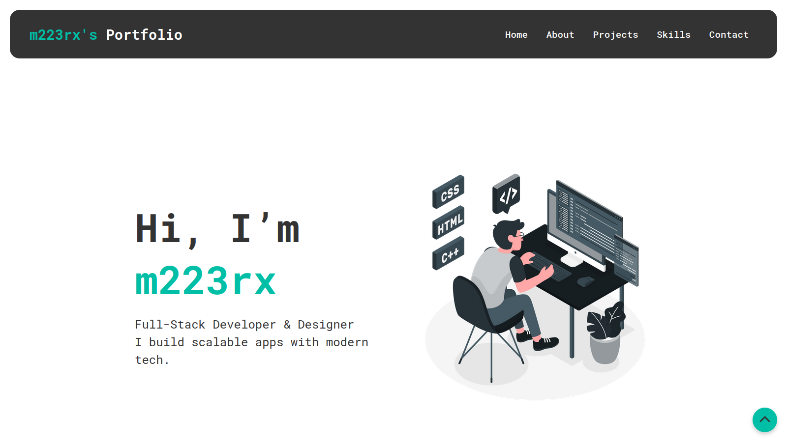
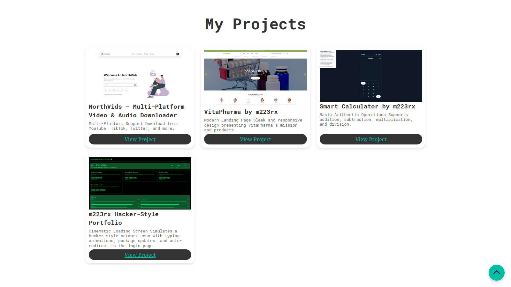
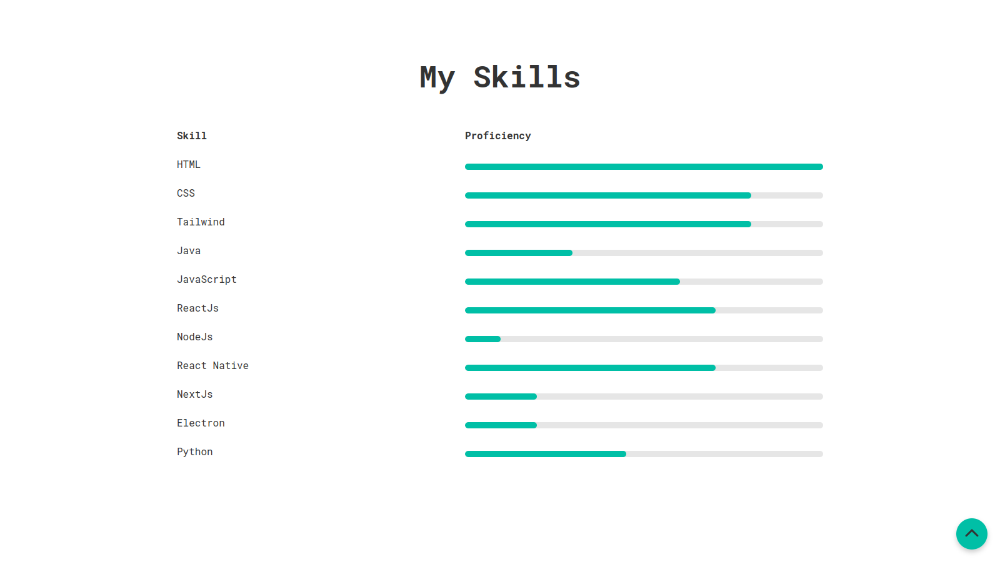

# 🌐 m223rx – Personal Portfolio  

---

## 🚀 Features  

- **Modern, Responsive Design**  
  Built with clean HTML & CSS to look great on any device.  

- **Smooth Navigation**  
  Easy-to-use header links to Home, About, Projects, Skills, and Contact sections.  

- **Interactive Intro Section**  
  Personal greeting with image and short tagline about your expertise.  

- **Detailed About Section**  
  Shows your background, skills, and interests in a conversational style.  

- **Project Showcases**  
  Eye-catching cards featuring your apps & designs with images, titles, and descriptions.  

- **Skills Progress Table**  
  Clear progress bars showing your proficiency in different technologies.  

- **Contact Form**  
  Simple form to let people reach out directly.  

- **Back-to-Top Button**  
  Smooth scroll back to the top of the page.  

---

## 🛠 Tech Stack

- **Frontend:**
  - [HTML5](https://developer.mozilla.org/en-US/docs/Web/HTML) – semantic structure  
  - [CSS3](https://developer.mozilla.org/en-US/docs/Web/CSS) – styling  
  - [Font Awesome](https://fontawesome.com/) – icons  

- **Deployment:**
  - Works perfectly with [GitHub Pages](https://pages.github.com/), [Netlify](https://www.netlify.com/), or any static hosting service.

---

## 📸 Screenshots

### Home Section  
  

### Projects Section  
  

### Skills Table  
  

---

## ⚡ Usage

1. **Clone the repository:**

   git clone https://github.com/m223rx/simple-portfolio.git

   cd simple-portfolio/client

2. **Open index.html in your browser**

3. **Customize content**

    Update index.html text, images, and links to your own info.

    Add new project cards in the Projects section.

    Edit progress bars under Skills to reflect your proficiency.

4. **Deploy:**

    Push to GitHub and enable GitHub Pages or upload to your hosting platform.

## 🎨 Customization

Replace images inside ./assets/images/ with your own (maintain same file names or update paths).

Edit the <nav> menu items to match your sections or add new ones.

Adjust styling in ./styles/styles.css to match your brand colors.

## 💡 Future Enhancements

Add a dark/light mode toggle.

Integrate a backend to make the contact form functional.

Add animations with JavaScript or libraries like GSAP.

Include more screenshots & project details.

## 👨‍💻 Developer
m223rx – 2025

© 2025 m223rx. All rights reserved.

---